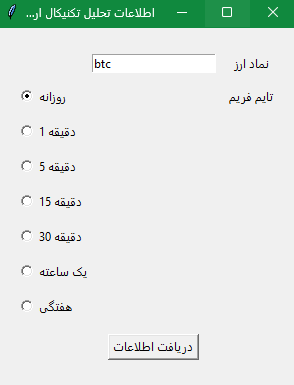
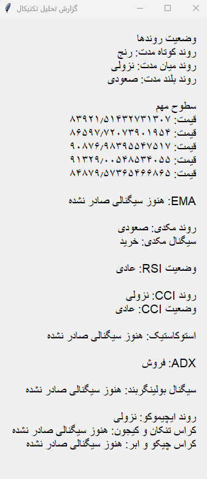

# cryptocurrency_analyst

In this project, I want to develop intelligent analytics agents for the cryptocurrency market. The technical analysis agent is currently being developed and needs optimization.

# Technical analysis

A technical analysis application for cryptocurrencies that provides trend and signal analysis using various indicators.

## Features

- Receives cryptocurrency name and timeframe for analysis  
- Uses indicators from `pandas_ta` for technical analysis  
- Fetches data from Yahoo Finance  
- Provides trend and signal insights  

## Screenshots

  
  

# Crypto News Analyzer

A web crawler that scrapes cryptocurrency news from CoinDesk, analyzes the content using a language model, and predicts Bitcoin price trends based on the news sentiment.

## Features

1. **Web Crawler**: 
   - Automatically scrapes the latest cryptocurrency news from CoinDesk.
   - Extracts relevant article data (headlines, content, dates).

2. **Sentiment Analysis**: 
   - Uses a language model to evaluate news sentiment.
   - Generates a probability score (0 to 1) predicting Bitcoin's price trend:
     - **Closer to 1**: Bullish (price likely to rise).
     - **Closer to 0**: Bearish (price likely to fall).

3. **User-Friendly Output**: 
   - Presents analyzed results in a clear format for users.
   - Focuses on actionable insights for cryptocurrency traders/investors.

## Example Output
The language model processes news input and returns a single probability value: 0.73 # Indicates a 73% chance of a bullish trend

# Installation

1. Clone the repository:  
   ```sh
   git clone https://github.com/hopedeveloper08/cryptocurrency_analyst
   cd cryptocurrency_analyst
   ```
2. Create a virtual environment:  
   ```sh
   python -m venv venv
   source venv/bin/activate  # On Windows: venv\Scripts\activate
   ```
3. Install dependencies:  
   ```sh
   pip install -r requirements.txt
   ```
